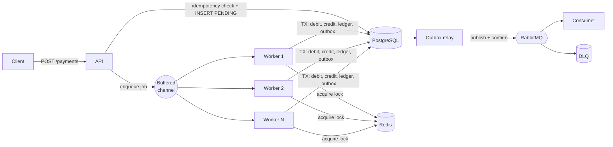

# 🌴 Buriti Pay

**High-concurrency payment processing in Go.**
Accepts thousands of simultaneous transactions, processes them in parallel, and never spends the same money twice.


> **Status:** ✅ Core implementation complete (Phases 0 through 7). Fully tested with distributed locking, idempotency, bounded worker pool, transactional outbox, and Prometheus telemetry.
> 📄 **Architecture & ADRs:** [`docs/architecture.md`](docs/architecture.md) · [`docs/roadmap.md`](docs/roadmap.md) · [`docs/benchmarks.md`](docs/benchmarks.md) · [`docs/adrs/`](docs/adrs/)

---

## Why this project exists

Moving money looks simple until many requests hit the same account at once. Without care, you get:

- **Race conditions**: two payments read the same balance and both succeed.
- **Duplicate charges**: a client retries, or a message is delivered twice.
- **Wasted resources**: needless allocations, GC pressure, blocked workers.

Buriti Pay is a focused study of how to solve these problems with Go's strengths: native concurrency, low latency and a small memory footprint.

## What it does

| Capability | How |
|------------|-----|
| Fast, non-blocking API | Replies `202 Accepted` immediately; work happens in the background |
| Parallel processing | Worker pool built on goroutines and buffered channels, with backpressure |
| Mutual exclusion across instances | Redis distributed lock with TTL, auto-renewal and safe release (Lua) |
| Money safety | ACID transactions, optimistic versioning, double-entry ledger |
| No duplicate charges | Idempotency keys enforced at the API and database level |
| Reliable async events | RabbitMQ with the transactional outbox pattern, retries and dead-letter queue |
| Low memory use | `sync.Pool`, pre-allocation, profiling with `pprof` |

## Architecture



**Life of a payment**

1. The client sends `POST /payments` with an `Idempotency-Key`.
2. The API stores the payment as `PENDING` and returns `202` with its ID.
3. The job enters a bounded channel. If it is full, the API answers `429` (backpressure).
4. A worker acquires the Redis lock for the source account.
5. Inside one database transaction, it moves the money, writes the ledger entries and an outbox event.
6. The lock is released (only by its owner).
7. The outbox relay publishes `payment.confirmed` (or `payment.failed`) to RabbitMQ.
8. Consumers process the event with manual ack, retry and DLQ.

> **Defense in depth:** the Redis lock reduces contention and duplicated work, but **PostgreSQL is the source of truth**. Even if a lock expires mid-flight, versioned updates and constraints prevent corruption.

More detail in [`docs/architecture.md`](docs/architecture.md).

## Tech stack

Go · PostgreSQL (`pgx`) · Redis (`go-redis`) · RabbitMQ (`amqp091-go`) · Docker Compose · `chi` · `slog` · `testcontainers-go` · Prometheus · k6

## Quick start

> Commands below describe the target developer experience and will work once Phase 1 is complete.

```bash
git clone https://github.com/<your-username>/buriti-pay.git
cd buriti-pay
cp .env.example .env
make up            # Postgres, Redis, RabbitMQ and the API
```

Create two accounts and send a payment:

```bash
curl -X POST localhost:8080/accounts -d '{"owner":"alice","initial_balance":100000}'
curl -X POST localhost:8080/accounts -d '{"owner":"bob","initial_balance":0}'

curl -X POST localhost:8080/payments \
  -H "Idempotency-Key: 7f3c1a9e-0001" \
  -H "Content-Type: application/json" \
  -d '{"from_account_id":"<alice-id>","to_account_id":"<bob-id>","amount":15000}'

curl localhost:8080/payments/<payment-id>
```

Amounts are integers in **cents** (`15000` = 150.00).

## API overview

| Method | Route | Description |
|--------|-------|-------------|
| `POST` | `/accounts` | Create an account |
| `GET` | `/accounts/{id}` | Get balance |
| `POST` | `/payments` | Create a payment (requires `Idempotency-Key`) |
| `GET` | `/payments/{id}` | Get payment status |
| `GET` | `/healthz` · `/readyz` | Liveness and readiness |
| `GET` | `/metrics` | Prometheus metrics |

## Project layout

```
buriti-pay/
├── cmd/            api and consumer entrypoints
├── internal/       domain, service, worker, lock, repository, messaging, http
├── migrations/     SQL migrations
├── deployments/    Dockerfile and docker-compose
├── loadtest/       k6 scenarios
└── docs/           architecture, roadmap, benchmarks, ADRs
```

## Testing

```bash
make test          # unit + integration (real Postgres/Redis/RabbitMQ via testcontainers)
make race          # go test -race ./...
make bench         # Go benchmarks with -benchmem
make loadtest      # k6 load scenarios
```

The central invariant checked by the tests: **the sum of all balances never changes, and the ledger always sums to zero**, even with 1,000 concurrent payments on the same account.

## Results

> Numbers will be added in Phase 6 from reproducible runs. Nothing here is estimated.

| Metric | Result |
|--------|--------|
| Throughput | _TBD_ |
| API latency p50 / p95 / p99 | _TBD_ |
| Memory per instance under load | _TBD_ |
| Balance divergence in load test | _TBD (target: 0)_ |

Methodology and raw data: [`docs/benchmarks.md`](docs/benchmarks.md) _(created in Phase 6)_.

## Design decisions

Key trade-offs are recorded as Architecture Decision Records in [`docs/adr`](docs/adr):

- [ADR-001](docs/adr/0001-async-processing-with-202.md): Asynchronous processing with `202 Accepted`
- [ADR-002](docs/adr/0002-money-as-integer-cents.md): Money as integer cents
- [ADR-003](docs/adr/0003-idempotency-keys.md): Idempotency keys
- [ADR-004](docs/adr/0004-redis-lock-plus-db-versioning.md): Redis lock plus database versioning
- [ADR-005](docs/adr/0005-transactional-outbox.md): Transactional outbox
- [ADR-006](docs/adr/0006-bounded-worker-pool.md): Bounded worker pool with backpressure

## Known limitations

- The payment gateway is **simulated**; no real money or card data is involved.
- A single-node Redis lock is not fault-tolerant on its own (see ADR-004 for how the database compensates).
- Authentication is a simple API key; this is a study project, not a production payment system.
- Message delivery is at-least-once; consumers are idempotent by design.

## Roadmap

Seven phases from foundation to showcase. See [`docs/roadmap.md`](docs/roadmap.md).

## License

MIT. See [`LICENSE`](LICENSE).

## Author

Built by **<Your Name>** · [Portfolio](#) · [LinkedIn](#) · [GitHub](#)
