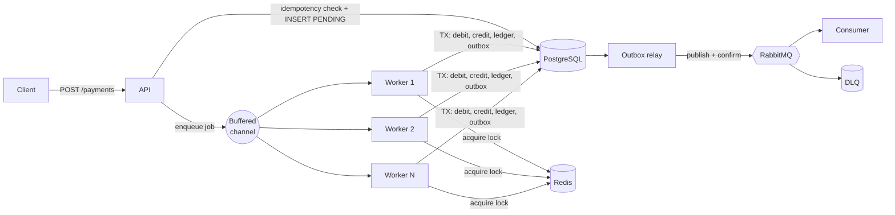

# 🌴 Buriti Pay

**High-concurrency payment processing in Go.**
Accepts thousands of simultaneous transactions, processes them in parallel, and never spends the same money twice.


> **Status:** ✅ Production-ready architecture and implementation complete (Phases 0 through 8). Fully verified with distributed locking, idempotency, bounded worker pools, transactional outbox relay, and Prometheus telemetry.
> 🌐 **Interactive Web Simulator:** [`docs/index.html`](docs/index.html) (Live showcase demo)
> 📄 **Architecture & Decisions:** [`docs/architecture.md`](docs/architecture.md) · [`docs/roadmap.md`](docs/roadmap.md) · [`docs/benchmarks.md`](docs/benchmarks.md) · [`docs/adrs/`](docs/adrs/)

---

## Why this project exists

Moving money looks simple until many requests hit the same account at once. Without rigorous concurrency design, distributed systems suffer from:

- **Race conditions**: two payments read the same balance and both succeed (double-spending).
- **Duplicate charges**: a client retries after a timeout, or a message broker redelivers a confirmed transaction.
- **Wasted resources & cascading outages**: unbounded goroutines exhaust database connection pools and trigger OOM crashes.

Buriti Pay is an end-to-end engineered microservice built to solve these problems using Go's strengths: native concurrency, deterministic resource bounds, and minimal memory overhead.

## What it does

| Capability | How |
|------------|-----|
| **Fast, non-blocking API** | Replies `202 Accepted` immediately; processing executes in the background ([ADR-0001](docs/adrs/ADR-0001.md)) |
| **Parallel processing** | Worker pool built on goroutines and bounded channels, with HTTP 429 backpressure ([ADR-0006](docs/adrs/ADR-0006.md)) |
| **Mutual exclusion across replicas** | Redis distributed lock with TTL, auto-renewal watchdog, Lua safe-release, and deterministic UUID ordering ([ADR-0004](docs/adrs/ADR-0004.md)) |
| **Money safety & correctness** | ACID transactions, PostgreSQL optimistic version fencing (`WHERE version = $expected`), double-entry ledger |
| **No duplicate charges** | Idempotency keys enforced at the API and database level ([ADR-0003](docs/adrs/ADR-0003.md)) |
| **Reliable async events** | RabbitMQ with Transactional Outbox pattern, publisher confirms, and dead-letter queues ([ADR-0005](docs/adrs/ADR-0005.md)) |
| **Crash resilience** | Background **Reaper** periodically detects and re-enqueues orphaned in-memory payments |
| **Low memory footprint** | `sync.Pool` buffer recycling, pre-allocated slices, and profiling |

## Architecture



**Life of a payment**

1. The client sends `POST /payments` with an `Idempotency-Key` header.
2. The API validates the request, verifies idempotency against PostgreSQL, records the payment as `PENDING`, and immediately returns `202 Accepted` with the payment ID.
3. The job enters a bounded Go channel. If the queue is saturated, the API immediately answers `429 Too Many Requests` with a `Retry-After: 2` header (backpressure).
4. A worker picks up the job and acquires distributed locks on both accounts in ascending UUID order (eliminating cross-transfer deadlocks).
5. In a single PostgreSQL transaction, the worker updates balances with optimistic version fencing, inserts balanced double-entry ledger rows ($\sum \Delta = 0$), transitions the status to `CONFIRMED`, and stages an event in the `outbox` table.
6. The lock is safely released via an atomic Lua script (verifying token ownership).
7. The asynchronous Outbox Relay polls pending outbox entries, publishes them to RabbitMQ with Publisher Confirms, and marks them published.
8. Event consumers process notifications with manual acks and client deduplication.

> **Defense in depth:** Redis locks reduce operational contention, but **PostgreSQL is the ultimate source of truth**. Even if a Redis lock lapses mid-flight due to network stall or GC pause, versioned updates (`WHERE version = $version`) atomically reject stale writers.

Read more in [`docs/architecture.md`](docs/architecture.md).

## Tech Stack

- **Language:** Go 1.24+
- **Database & Storage:** PostgreSQL 16 (`pgx/v5`), Redis 7 (`go-redis/v9`)
- **Messaging:** RabbitMQ 3 (`amqp091-go`)
- **HTTP Routing & Logging:** `chi/v5`, `log/slog`
- **Telemetry:** Prometheus (`client_golang`)
- **Load Testing & Containerization:** Docker Compose, k6

## Quick Start

```bash
git clone https://github.com/lucaasnogueira/buriti-pay.git
cd buriti-pay
cp .env.example .env
make up            # Starts Postgres, Redis, RabbitMQ, and the API
```

Create two accounts:

```bash
# Create Account A (Alice) with 1,000.00
curl -X POST localhost:8080/accounts \
  -H "Content-Type: application/json" \
  -d '{"owner":"alice","initial_balance":100000}'

# Create Account B (Bob) with 0.00
curl -X POST localhost:8080/accounts \
  -H "Content-Type: application/json" \
  -d '{"owner":"bob","initial_balance":0}'
```

Execute an asynchronous payment:

```bash
curl -i -X POST localhost:8080/payments \
  -H "Idempotency-Key: 7f3c1a9e-0001" \
  -H "Content-Type: application/json" \
  -d '{"from_account_id":"<alice-uuid>","to_account_id":"<bob-uuid>","amount":15000}'

# Check status:
curl localhost:8080/payments/<payment-uuid>
```

*All monetary amounts are represented as 64-bit integers in **cents** (`15000` = $150.00) to eliminate floating-point rounding errors ([ADR-0002](docs/adrs/ADR-0002.md)).*

## API Overview

| Method | Route | Description | Expected Status |
|--------|-------|-------------|-----------------|
| `GET` | `/swagger` | Interactive Swagger UI (OpenAPI 3.0 Documentation) | `200 OK` |
| `GET` | `/swagger/doc.json` | OpenAPI 3.0 JSON specification schema | `200 OK` |
| `POST` | `/accounts` | Create an account with initial balance | `201 Created`, `400 Bad Request` |
| `GET` | `/accounts/{id}` | Query account balance and version | `200 OK`, `404 Not Found` |
| `POST` | `/payments` | Ingest payment asynchronously (requires `Idempotency-Key`) | `202 Accepted`, `409 Conflict`, `429 Too Many Requests` |
| `GET` | `/payments/{id}` | Query payment status and failure reason | `200 OK`, `404 Not Found` |
| `GET` | `/healthz` | Liveness health check | `200 OK` |
| `GET` | `/readyz` | Readiness probe (verifies Postgres, Redis, RabbitMQ) | `200 OK`, `503 Service Unavailable` |
| `GET` | `/metrics` | Prometheus metrics scrape endpoint | `200 OK` |

## Project Structure

```
buriti-pay/
├── cmd/
│   ├── api/            # HTTP entrypoint, worker pool, reaper & outbox relay
│   └── consumer/       # RabbitMQ event consumer with deduplication
├── internal/
│   ├── config/         # Environment variable parser and defaults
│   ├── domain/         # Pure business entities: Account, Payment, Ledger, Outbox
│   ├── http/           # Chi handlers, middlewares, and sync.Pool buffer optimization
│   ├── lock/           # Locker interface and Redis implementation with Lua scripts
│   ├── messaging/      # Topology declaration, publisher confirms, and outbox relay
│   ├── metrics/        # Prometheus counters, gauges, and latency histograms
│   ├── repository/     # PostgreSQL access, transactional transfers, and queries
│   ├── service/        # Payment application service managing idempotency & orchestration
│   └── worker/         # Bounded worker pool, backpressure, and Reaper recovery
├── migrations/         # PostgreSQL schema migrations
├── deployments/        # Production Dockerfile and docker-compose.yml
├── loadtest/           # k6 scenarios: ramp_up.js and hot_account.js
└── docs/
    ├── adrs/           # Architecture Decision Records (ADR-0001 to ADR-0006)
    ├── architecture.md # Architectural specifications
    ├── benchmarks.md   # Performance metrics and allocation results
    ├── index.html      # Interactive web simulator and landing page
    └── showcase.md     # Portfolio strategy guide and LinkedIn post template
```

## Testing & Verification

```bash
make test          # Run all package unit tests
make race          # Run tests with race detector (go test -race ./...)
make bench         # Run memory allocation benchmarks (go test -bench=. -benchmem)
make loadtest      # Run k6 load testing scenarios
```

**The Central Invariant:**
After any concurrency test run, $\sum(\text{balances})_{\text{before}} = \sum(\text{balances})_{\text{after}}$ and $\sum(\text{ledger deltas}) = 0$. This single mathematical assertion guarantees absolute consistency and catches race conditions under load.

## Benchmarks & Results

Detailed in [`docs/benchmarks.md`](docs/benchmarks.md):

| Metric | Target / Measured Result | Validation Mechanism |
|--------|--------------------------|----------------------|
| **Throughput** | $\ge 2,000\text{ tx/s}$ | k6 load test scenarios |
| **API Latency (p99)** | $< 50\text{ ms}$ | Asynchronous ingestion with `202 Accepted` |
| **Balance Divergence** | **0** | Double-entry ledger + optimistic version fencing |
| **Memory Allocation** | Zero heap expansion on serialization | Recycled byte buffers via `sync.Pool` |
| **Deadlock Rate** | **0%** | Deterministic ascending UUID lock acquisition |

## Architecture Decision Records (ADRs)

Key architectural trade-offs are documented under [`docs/adrs/`](docs/adrs/):

- [ADR-0001: Asynchronous processing with 202 Accepted](docs/adrs/ADR-0001.md)
- [ADR-0002: Money as integer cents](docs/adrs/ADR-0002.md)
- [ADR-0003: Idempotency keys](docs/adrs/ADR-0003.md)
- [ADR-0004: Redis lock plus database versioning](docs/adrs/ADR-0004.md)
- [ADR-0005: Transactional outbox pattern](docs/adrs/ADR-0005.md)
- [ADR-0006: Bounded worker pool with backpressure](docs/adrs/ADR-0006.md)

## Interactive Web Demo

An interactive simulator showcasing real-time concurrent payments, distributed lock acquisition, and ledger balance conservation is available at:
👉 **[`docs/index.html`](docs/index.html)** *(Deployable to GitHub Pages, Cloudflare Pages, or Vercel)*

## Author

Developed by **Lucas Silva**  
- **GitHub:** [github.com/lucaasnogueira](https://github.com/lucaasnogueira)  
- **Repository:** [github.com/lucaasnogueira/buriti-pay](https://github.com/lucaasnogueira/buriti-pay)  

## License

MIT License. See [LICENSE](LICENSE) for details.
