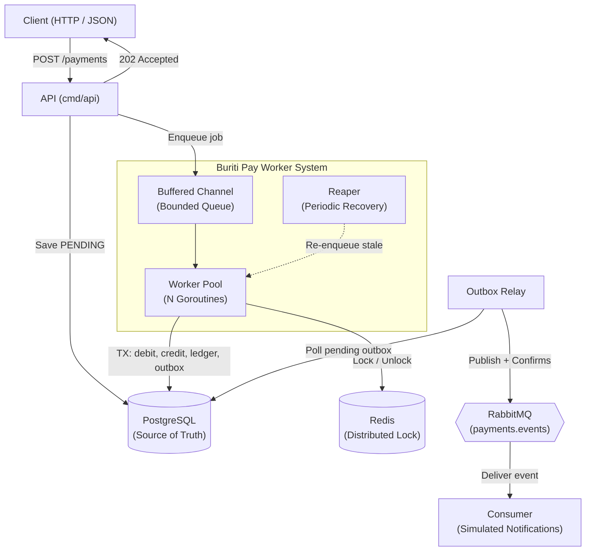

# Architecture Document

## Overview

Buriti Pay is a high-concurrency payment-processing microservice designed in Go to demonstrate safe, distributed, and scalable fund transfers under high contention.

## Core Design Principles

1. **PostgreSQL as Single Source of Truth:**
   Redis locks provide operational mutual exclusion to minimize database contention and lock collisions, but optimistic row versioning (`WHERE version = $expected`) and database constraints guarantee correctness even in the event of partition or lock timeout.

2. **Defense in Depth against Double-Spending:**
   - Client idempotency keys with unique database constraint.
   - Deterministic resource ordering (ascending UUIDs) to prevent deadlocks.
   - Atomic database transactions with double-entry balance bookkeeping.

3. **Resilience & Bounded Resources:**
   - Worker pool sized to hardware (`NumCPU * 4`).
   - Bounded in-memory queues emitting HTTP 429 backpressure on saturation.
   - Transactional outbox ensuring reliable event delivery even across broker downtime.
